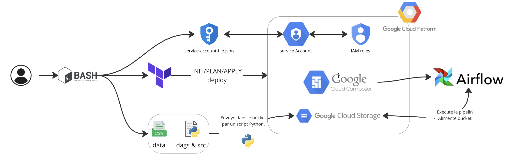

# Projet de Pipeline de Données

Ce projet implique la construction d'un pipeline de données utilisant Apache Airflow et les services Google Cloud pour traiter des données liées aux médicaments, générer des insights et stocker les résultats dans Google Cloud Storage (GCS).

## Description des Dossiers

- **dags** : Contient les DAGs qui vont tourner sur Apache Airflow.
- **src** : Contient les scripts alimentant Airflow avec les différents modules d'ingestion et de transformation, ainsi que la pipeline.
- **script** : Contient les différents codes à lancer en ligne de commande, y compris le traitement ad-hoc qui est `analysis_task`.
- **data** : Contient les données sources pour nos traitements ainsi que le composer_bucket.json
- **result** : Contient notre fichier resultat output.json (exporté à la suite de l'exécution de la pipeline)
- **test** : Contient les tests unitaires et d'intégration.

## Architecture



L’architecture repose sur Composer (+Apache Airflow), déployé par terraform, pour orchestrer les traitements, avec stockage des données dans GCS et exécution des transformations via des scripts Python.

Dans la version actuel tout est executé par l'utilisateur en bash. (v1)

Une version automatisé pourra être mise en place avec de la ci/cd sur github (v2)

## Prérequis

- Compte GCP et un project opérationnel qui va l'héberger.

Assurez-vous d'avoir les outils suivants installés :
- Terraform
- Google Cloud SDK
- TFLint
- Packages Python : `google-cloud-storage`, `gcsfs`

## Création de l'Environnement Virtuel et Installation des Dépendances

Avant de configurer le projet, suivez ces étapes pour créer un environnement virtuel et installer les dépendances nécessaires :

1. **Créer un environnement virtuel**:
   - Naviguez vers votre répertoire de projet :
     ```bash
     cd /path/to/Python_test_DE
     ```
   - Créez un environnement virtuel nommé `venv` :
     ```bash
     python3 -m venv venv
     ```

2. **Activer l'environnement virtuel**:
   - Sur macOS et Linux :
     ```bash
     source venv/bin/activate
     ```
   - Sur Windows :
     ```bash
     .\\venv\\Scripts\\activate
     ```

3. **Installer les dépendances**:
   - Avec l'environnement virtuel activé, installez les dépendances :
     ```bash
     pip install -r requirements.txt
     ```

Ces étapes vous permettront de configurer un environnement isolé pour votre projet, garantissant que toutes les dépendances sont gérées correctement.

## Instructions de Configuration

1. **Définir les Identifiants d'Application Google**
   
   Exportez vos identifiants de compte de service Google Cloud en suivant ces étapes :
   - allez dans le menu "IAM & Admin" -> "Comptes de service" -> sélectionner le compte de service qui a comme droit "Composer Admin" -> "Clés" -> "Ajouter une clé" -> "Crée une clé" -> "JSON" -> "Crée".
   - nommez ce fichier "service-account-file.json" et stockez-le à la racine de votre projet.
   - exécutez cette commande:

   ```bash
   export GOOGLE_APPLICATION_CREDENTIALS="service-account-file.json"
   ```

2. **Authentification avec Google Cloud**

   Connectez-vous à votre compte Google Cloud :
   ```bash
   gcloud auth application-default login
   ```

3. **Définir le Projet Google Cloud**

   Définissez votre projet GCP :
   ```bash
   gcloud config set project <id-du-projet>
   ```


## Déploiement avec Terraform

Avant de passer à la gestion des erreurs et reprises, suivez ces étapes pour déployer votre environnement avec Terraform :

0. **Configuration des variables**
   - Créez un fichier `terraform.tfvars` dans le répertoire `terraform` de votre projet. Voici un template, ces informations serviront à la création de votre environnement Composer sur GCP.

   ```tr
      project_id      = " "
      region          = " "
      zone            = " "
      composer_name   = " "
      service_account = " "
   ```
1. **Initialisation de Terraform**:
   - Accédez au répertoire Terraform de votre projet :
     ```bash
     cd /path/to/your/terraform/directory
     ```
   - Initialisez Terraform pour télécharger les plugins nécessaires :
     ```bash
     terraform init
     ```

2. **Vérification du Plan de Déploiement**:
   - Exécutez la commande suivante pour voir un aperçu des ressources qui seront créées :
     ```bash
     terraform plan
     ```

3. **Application du Plan de Déploiement**:
   - Appliquez le plan pour créer les ressources dans Google Cloud :
     ```bash
     terraform apply
     ```
   - Confirmez l'application lorsque vous y êtes invité. patientez plusieurs minutes


## Récupération du Nom du Bucket pour la config

Avant de procéder à l'exécution du pipeline, vous devez récupérer le nom du bucket associé à votre environnement Google Cloud Composer. Utilisez la commande suivante pour obtenir les détails de votre environnement Composer et extraire le nom du bucket :

```bash
gcloud composer environments describe <composer-name> --location <region>
```

Stockez ensuite le nom du bucket dans un fichier `composer_bucket.json`, ce fichier est important car il est par les script pour upload nos fichier dans le bucket :

```bash
echo '{"composer_bucket": "<bucket-name>"}' > data/composer_bucket.json
```

Remplacez `<bucket-name>` par le nom du bucket extrait de la commande précédente.


Ces étapes vous permettront de configurer et de déployer votre environnement Google Cloud Composer avec Terraform, en incluant la création de buckets et autres ressources nécessaires.


**Télécharger les DAGs, Source, et Données vers GCS**

   Utilisez les scripts fournis pour télécharger vos fichiers vers Google Cloud Storage :
   ```bash
   python script/upload_to_gcs.py
   ```

## Exécution de la Pipeline

Une fois tout configuré, vous pouvez déclencher votre pipeline de données en utilisant Apache Airflow ou directement sur le service composer gcp.
le fichier resultat sera dans le bucket <bucket-name>/data/output.json

### Résultats
Exécution de la pipeline avec succès :
 


Création du fichier json en sortie :


## Récupération du fichier output.json :
```bash
python script/upload_from_gcs.py
```
Ce script permet de télécharger le fichier output.json présent dans le bucket en local (chemin : result/output.json)


## Exécution du traitement ad-hoc 

Une fois tout configuré et que le bucket est récupéré, vous pouvez exécuter le traitement ad-hoc en utilisant la commande suivante :

```bash
python script/analysis_task.py
```

### Résultat


## Exécution des Tests

Pour exécuter les tests, utilisez la commande suivante dans le répertoire racine de votre projet :

```bash
pytest tests/
```

Cette commande exécutera tous les tests unitaires et d'intégration présents dans le répertoire `tests`.

# Potentiels évolutions du code afin de gérer de grandes volumétries de Données

Pour faire évoluer notre code afin de gérer de grandes volumétries de données, telles que des fichiers de plusieurs téraoctets ou des millions de fichiers, nous devrons considérer les éléments suivants et les modifications potentielles :

1. **Traitement en Parallèle** :
   - Nous utiliserons des frameworks de traitement parallèle comme Apache Spark pour distribuer les tâches de traitement des données sur plusieurs nœuds, réduisant ainsi le temps nécessaire pour traiter de grands ensembles de données.

2. **Formats de Stockage Efficaces** :
   - Nous utiliserons des formats de stockage efficaces comme Parquet ou Avro qui sont optimisés pour la performance de stockage et de requête, surtout lorsqu'il s'agit de grands ensembles de données.
   - Il sera plus efficace d'utiliser et de stocker directement les données sur des services comme Google Cloud Storage (GCS) ou BigQuery afin de minimiser le transfert de données. Des outils comme Fivetran pourront être utilisés pour intégrer les données directement dans ces services, permettant ainsi de consommer les données directement à partir de ces plateformes sans avoir à les transférer depuis le local vers le GCS du Composer.

3. **Mise à l'Échelle des Ressources** :
   - Nous exploiterons les services cloud qui offrent des capacités d'auto-scaling pour allouer dynamiquement les ressources en fonction de la charge de travail.
   - Sur Google Cloud Platform (GCP), il sera possible de créer des services sur Composer qui pourront s'adapter automatiquement, comme Composer 2 qui évoluera automatiquement en fonction des exigences des DAG et tâches exécutées. Cela optimisera les coûts et les performances. Composer utilisera des clusters Kubernetes sous-jacents qui pourront être configurés pour l'auto-scaling, nous permettant de gérer efficacement les charges de travail fluctuantes sans intervention manuelle.

4. **Surveillance et Journalisation** :
   - Nous mettrons en œuvre une surveillance et une journalisation robustes pour suivre les performances du système et identifier les goulets d'étranglement ou les échecs en temps réel.
   - Nous utiliserons Google Cloud Monitoring pour les métriques et les alertes.
   - Nous utiliserons Google Cloud Logging pour centraliser et analyser les logs.
   - Nous composerons notre pipeline de données avec Composer, qui s'intégrera à ces services pour suivre les DAGs et les tâches, et configurer des alertes en cas de problème.

5. **Gestion des Erreurs et Reprises** :
   - Nous concevrons le système pour gérer gracieusement les erreurs et mettrons en œuvre des mécanismes de reprise pour les échecs transitoires.
   - Nous ajouterons davantage de tests unitaires pour garantir la robustesse du code et détecter les erreurs potentielles avant qu'elles n'affectent le système en production.

6. **Automatisation** :
   - Nous automatisons le processus de déploiement et de maintenance du système en utilisant des outils comme argo
   - Executer le composer afin de refresh toutes les donénes à un instant donnée (fichiers yaml)

En considérant ces éléments et en apportant les modifications nécessaires, nous pourrons améliorer l'évolutivité de notre pipeline de données pour gérer efficacement de grandes volumétries de données.

Pour des commandes ou des configurations supplémentaires, veuillez vous référer à la documentation du projet ou contacter l'équipe de développement.
